# PDF 双语对照阅读器

本地优先的 **PDF 双语对照阅读 / 翻译桌面软件**：打开 PDF → 文本层/OCR 提取（VLM 结构化解析交叉校验）→ LLM 翻译 → **左右对照 / 译文紧跟 / 原版对照 / 排版对照 PDF** 四种模式阅读。

**核心能力一览**：

- 📖 **四种阅读模式**（工具栏分「重排版」「原版PDF」两组）：重排版·左右对照 / 重排版·紧跟 / 原版PDF·原版对照（pdfjs 像素级原样渲染 + 已译块高亮 + 点击看译文浮层，公式/图表/复杂版式零损失）/ 原版PDF·左右对照（BabelDOC 排版对照 PDF 应用内阅读）
- 🔬 **识别引擎混合架构**：区域快照+遮罩 → PaddleOCR-VL 整页结构化解析（公式成 LaTeX）→ 与文本层交叉校验（查全率≥0.90×精确率≥0.75 双阈值），不达标自动降级文本层管线，内容零损失兜底；DocLayout-YOLO 版面模型提供标题层级/无框表/版权噪音结构信号
- 🗂 **文献库与多会话**：已翻译文章持久化列表（缓存重建秒开）、文件夹归类/重命名/删除（二次确认）、多篇文章同时后台翻译、标题栏全局进度、**上传即入库**（PDF 自动复制进应用数据目录，原文件移动/改名/删除零影响）
- 📄 **BabelDOC 排版对照 PDF**：一键生成原版排版+译文的对照 PDF（随包内置运行时，开箱即用；单并发排队 + 实时进度）；**上传时可选「原版对照」模式**（添加文章页内选择）——跳过重排版直接生成对照 PDF（版式还原更稳，仅英→中），此类文档在文献库带「对照」角标、阅读页为单一对照形态
- 🧮 **公式全家桶**：提取期公式占位符保护 → KaTeX 渲染；公式密集块可按需「式」按钮 → 视觉模型转 LaTeX（块级缓存幂等）
- 📊 **图表处理**：图表区域检测与快照嵌入（caption 边界收夹防吞正文）；表格按需「译」按钮生成**译制图**（保留原排版，表内文字译成中文）
- 🈯 **翻译质量工程**：术语表两遍法、批翻减半重试、回声/融合译文三层层层设防、块级手动重译、提示词版本化
- 💾 **内容寻址缓存**：同一段文字/同一页提取/同一公式全局只算一次，重开文档秒出；版本号熔断让算法升级自动失效旧缓存
- 🛠 桌面级体验：页面缩略图导航、暗色模式、拖拽上传、单实例守卫（重复启动自动聚焦已有窗口）、导出双语 Markdown / 排版对照 PDF、中文排版修正（斜体转粗体）、链接外部浏览器打开
- ☁️ 全部走云端 API（OCR 与翻译均用 [SiliconFlow](https://siliconflow.cn)，免费额度即可），exe 不含任何模型权重（排版对照首次使用时在线下载约 50MB 版面权重）

> 设计目标：**个人本地使用 + 开源可复刻**。配置一次 API Key 即可开箱阅读；他人 clone 后按本文档即可跑起来。
>
> 🇨🇳 国内访问：仓库同步托管于 [Gitee 镜像](https://gitee.com/sssssia/pdf-bilingual-reader)；安装包体积较大，请到 [GitHub Releases](https://github.com/SSSSSia/PDF-Bilingual-Reader/releases) 下载。

---

## 应用一览

### 原版PDF·原版对照 —— 公式/图表/复杂版式零损失

pdfjs 像素级渲染原页面，已译块蓝色高亮；点击任意段落弹出译文浮层：

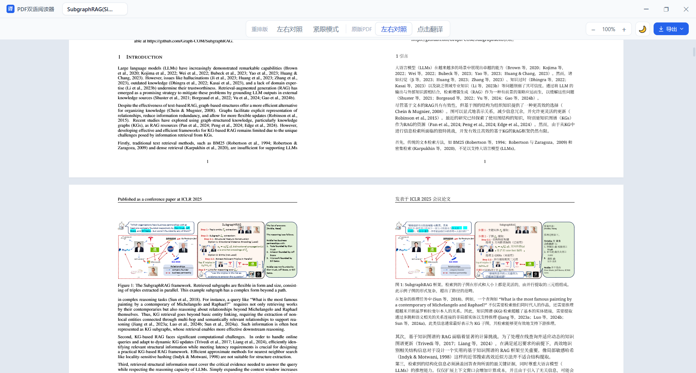

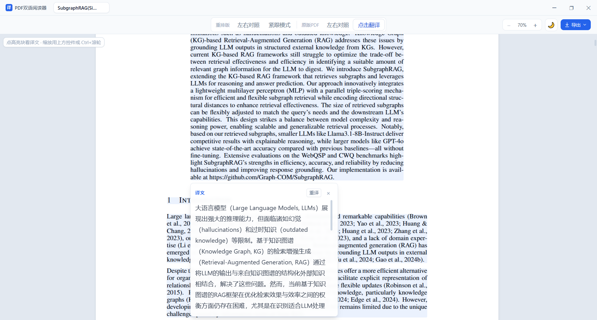

### 重排版双语 —— 左右对照（亮/暗色）与紧跟

| 左右对照 · 亮色 | 左右对照 · 暗色 |
|:---:|:---:|
| 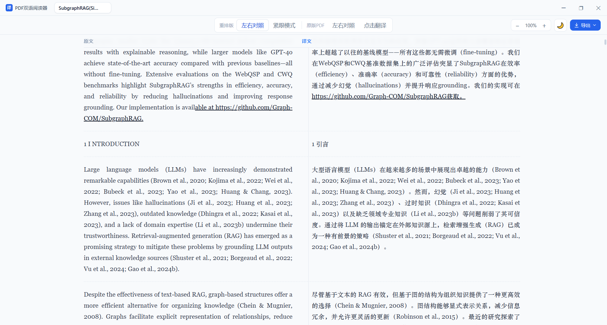 | 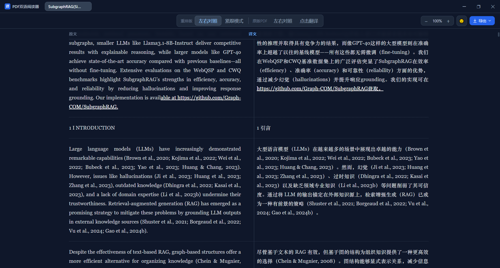 |

紧跟模式：原文段下嵌入译文，单栏沉浸阅读：

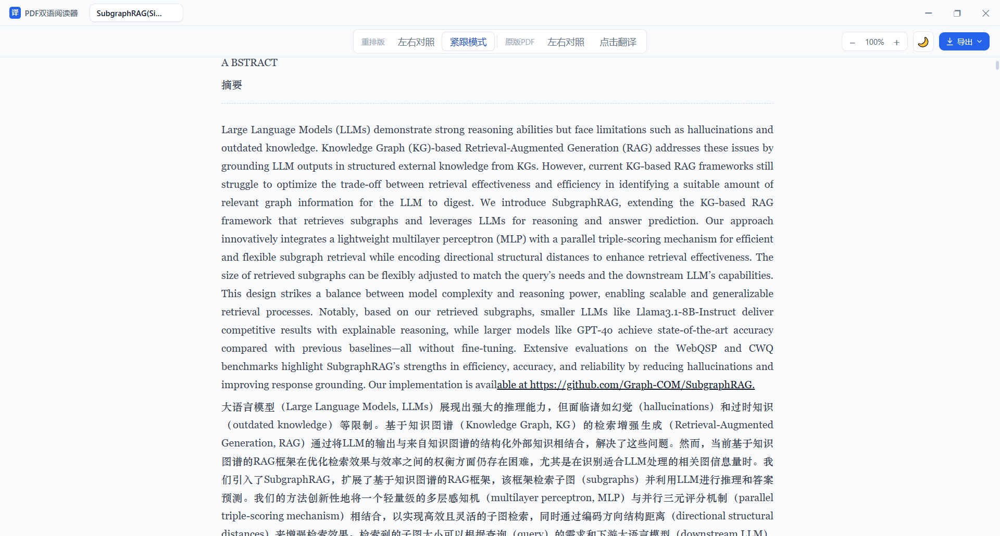

### 文献库 —— 上传即自动翻译，多会话并行

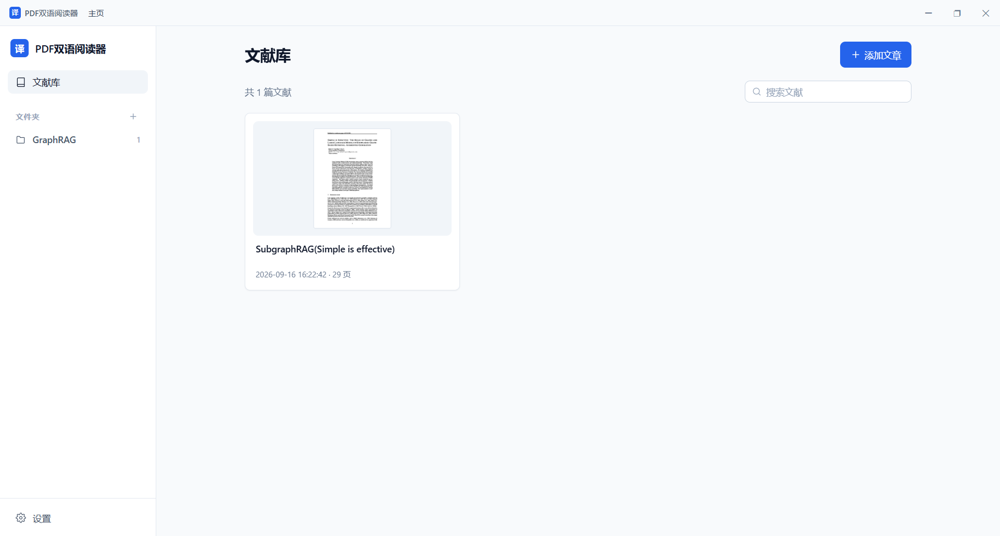

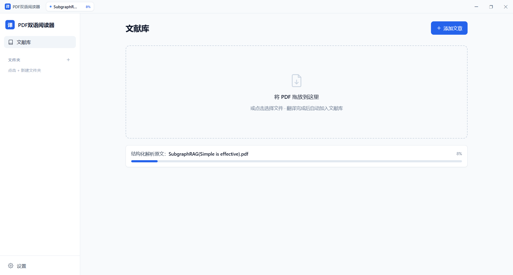

### 导出 —— 双语 Markdown / 原版对照 PDF

| 应用内导出菜单 | 对照 PDF 可用任意阅读器打开 |
|:---:|:---:|
| 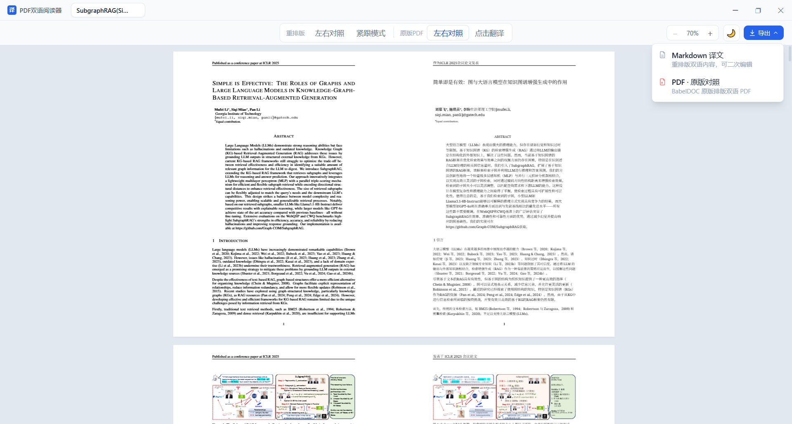 | 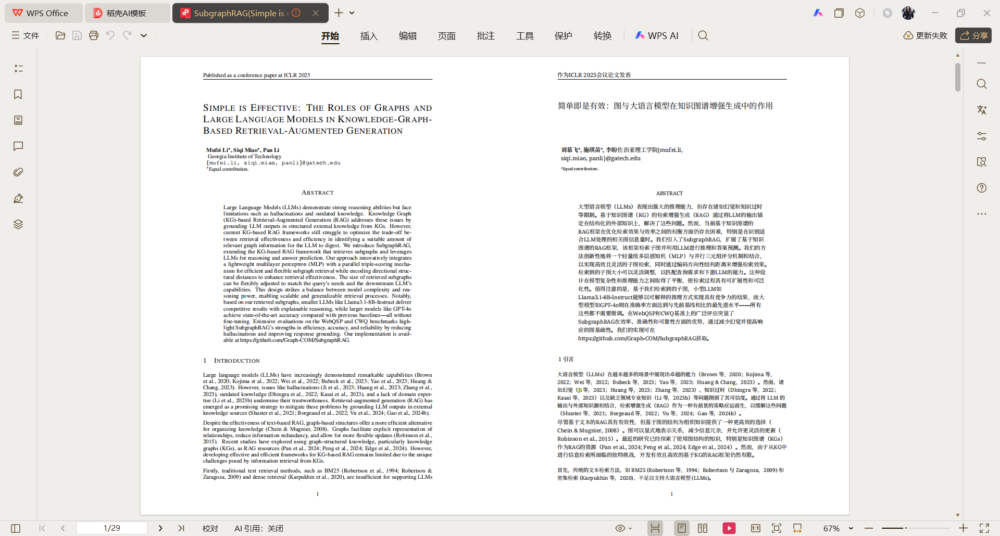 |

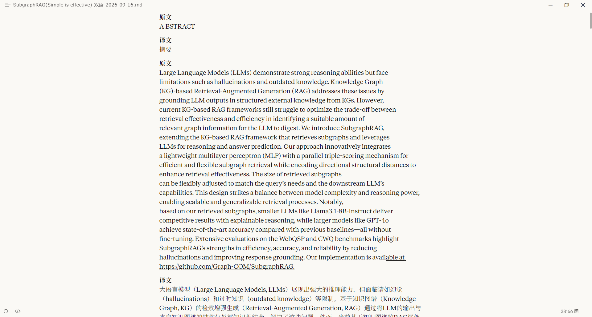

### 设置 —— 填入 SiliconFlow API Key 即可使用

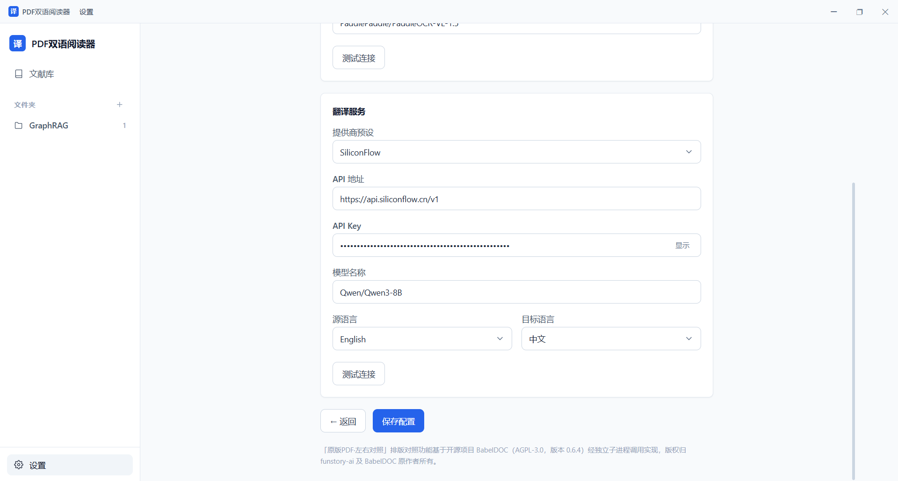

---

## 技术栈

| 层 | 技术 |
|----|------|
| 桌面壳 | Tauri v2（Rust） |
| 前端 | React 18 + TypeScript 5 + Vite 5 + Tailwind CSS 3 + Zustand 4 |
| 公式渲染 | remark-math + rehype-katex（KaTeX） |
| 原版模式 | pdfjs-dist（canvas 逐页渲染 + 坐标 overlay） |
| 后端 | FastAPI（Python 3.11+），以 Tauri **sidecar** 形式内嵌随安装包分发 |
| PDF 解析 | PyMuPDF + pymupdf4llm（文本层优先，扫描页混合 OCR） |
| 版面模型 | DocLayout-YOLO（随包 BabelDOC 运行时自带，独立子进程调用；标题/图表/噪音区域信号） |
| OCR | SiliconFlow `PaddlePaddle/PaddleOCR-VL-1.5`（文档解析 VLM，整页/公式块/表格通用） |
| 排版对照 PDF | [BabelDOC](https://github.com/funstory-ai/BabelDOC) 0.6.4（独立 venv 随包捆绑） |
| 翻译 | SiliconFlow（OpenAI 兼容 `chat/completions`），provider 抽象可扩展（deepl/google 占位待实现） |

架构数据流：

```
React 前端 (src/)
   │  invoke (Tauri 命令) / HTTP 双模桥接 (bridge.ts)
   ▼
Rust 壳 (src-tauri) ── reqwest ──► FastAPI 后端 (127.0.0.1:8000)
                                    │  pipeline: 提取→切块→翻译→回填
                                    │  ├─ 文本层提取 (PyMuPDF) + 扫描页 OCR
                                    │  ├─ 数字页主路径：区域快照+遮罩 →
                                    │  │   PaddleOCR-VL 整页结构化解析 →
                                    │  　  交叉校验（查全率×精确率）→ 降级兜底
                                    │  ├─ 布局分析：DocLayout-YOLO 版面区域 +
                                    │  │   双栏重排/跨页合并/块级 bbox
                                    │  └─ 缓存：OCR 层 / 译文层 / 公式层（内容寻址）
                                    │  HTTPS + Bearer Key
                                    ▼
                          SiliconFlow API（OCR：PaddleOCR-VL / 翻译：LLM）
```

---

## 环境要求

| 依赖 | 版本 | 用途 |
|------|------|------|
| Node.js | ≥ 20 | 前端 / Tauri CLI |
| Python | ≥ 3.11 | 内嵌后端（也用于开发态直接起 FastAPI） |
| Rust 工具链 | 稳定版 | 编译桌面壳 |
| **Windows 10/11 SDK** | — | **Rust 的 MSVC 链接必需**（见下方「排错」） |
| SiliconFlow API Key | — | OCR 与翻译（免费额度即可） |

> 分发包仅面向 **Windows**。文档写清了依赖与步骤，便于他人参考复刻，但不保证开箱跨平台。

---

## 安装即用（推荐普通用户）

到 [Releases](https://github.com/SSSSSia/PDF-Bilingual-Reader/releases) 下载安装包（MSI 或 NSIS exe，x64），安装后：

1. 打开 设置 → 填入 SiliconFlow API Key

   > OCR 与翻译共用 API，[硅基流动](https://cloud.siliconflow.cn) 的免费小参数模型即可满足日常使用，实测翻译质量也不错。注册时可自愿填写邀请码 `H8b0vER1`（注册成功送 16 元代金券，用于前沿模型也能用挺久）。

2. 「+ 添加文章」上传 PDF → 翻译自动开始，完成后进入阅读

安装包已内置 Python 后端与 BabelDOC 运行时，**无需安装 Python 或任何依赖**；上传的 PDF 会自动复制进应用数据目录（`%APPDATA%/pdf-reader/files/`），此后原文件移动/删除均不影响阅读与导出。

- **升级**：直接下载新版覆盖安装即可，文献库、翻译缓存与配置全部保留（建议安装前先关闭旧版本）。升级后的第一次启动，杀毒软件会扫描新落盘的文件，可能多等几秒，属一次性现象。
- **单实例**：重复双击图标不会开出第二个窗口，会自动聚焦已打开的窗口。

---

## 快速开始（开发态）

```powershell
# 1) 安装前端依赖
npm install

# 2) 准备后端依赖（建议用虚拟环境）
cd backend
python -m venv .venv
.venv\Scripts\Activate.ps1
pip install -r requirements.txt
cd ..

# 3) 配置 API Key
#    复制模板并填入你的 SiliconFlow Key：
cp config/config.example.json config/config.json
#    然后编辑 config/config.json，把 ocr.api_key / translate.api_key 填上

# 4) 一键启动（前端 + 后端 + Tauri 窗口）
powershell -ExecutionPolicy Bypass -File scripts/dev-start.ps1
```

开发态下 Rust 端**不会**拉起内嵌 sidecar，而是沿用脚本启动的外部 FastAPI（避免争用 8000 端口）。

> ⚠️ 无论哪种开发态，只要走 Tauri 窗口（`npm run tauri dev`）就**需要编译 Rust 壳**，即本机必须装有「C++ 生成工具 + Windows 10/11 SDK」，并在 **VS Developer PowerShell** 中运行（否则 `link.exe` 会被 Git Bash 的 GNU `link` 劫持而链接失败）。

---

## 纯浏览器开发模式（免 Rust 编译，便于人工测试）

如果你的机器**暂时无法编译 Rust**（缺 Windows SDK 等），可以用纯浏览器模式手动测试完整 UI 与后端交互，无需 `tauri dev`：

```powershell
# 终端 A：起 Python 后端（监听 127.0.0.1:8000）
cd backend
python -m venv .venv && .venv\Scripts\Activate.ps1
pip install -r requirements.txt
python main.py

# 终端 B：起前端（Vite，默认 http://localhost:5173）
npm run dev
```

然后在浏览器打开 `http://localhost:5173` 即可。前端已内置**双模桥接**（`src/lib/bridge.ts`）：检测到非 Tauri 环境时，会自动把原本走 Tauri IPC 的调用改走本地后端 HTTP 接口——

- 选 / 拖入 PDF → 经 `/api/upload` 上传到后端并拿到服务端路径 → 走 `/api/pipeline/run` + 轮询 `/api/pipeline/status`；
- 设置页读写 Key → 走 `/api/config`（GET/POST）；
- 缩略图 → 经 `/api/file/raw` 读取 PDF 字节。

> 注意：此模式仅在**本地**连 `localhost:8000`，不触碰任何第三方 API，也不在前端硬编码 Key，符合项目的「Key 只在本地后端」原则。导出功能在浏览器下走 Blob 下载（无 Rust 写文件权限）。生产环境（打包 exe）仍走 Tauri 原生路径，互不影响。

---

## 配置

### 配置文件位置（按优先级）

1. 环境变量 `PDF_READER_CONFIG` 指向的文件（可选，测试 / 自定义部署用）
2. Windows：`%APPDATA%/pdf-reader/config.json`
3. 其他：`~/.pdf-reader/config.json`

### 配置字段（全部 `snake_case`）

```jsonc
{
  "ocr": {
    "provider": "siliconflow",
    "api_key": "<你的 SiliconFlow Key>",
    "api_url": "https://api.siliconflow.cn/v1",
    "model": "PaddlePaddle/PaddleOCR-VL-1.5",   // 文档解析 VLM：整页 OCR / 公式识别通用
    "optional_payload": {
      "useDocOrientationClassify": false,
      "useDocUnwarping": false,
      "useChartRecognition": false
    }
  },
  "translate": {
    "provider": "siliconflow",
    "api_key": "<你的 SiliconFlow Key>",
    "api_url": "https://api.siliconflow.cn/v1",
    "model": "deepseek-ai/DeepSeek-V4-Flash",   // 任意 OpenAI 兼容对话模型
    "target_language": "zh",                     // 译文语言
    "source_language": "en"                      // 原文语言
  },
  "ui": { "default_mode": "bilingual", "theme": "light" }
}
```

> OCR 与翻译使用同一家的免费模型，填同一个 Key 即可。示例默认按**英文论文 → 中文**配置（与 `config/config.example.json` 一致），方向相反请对调 `source_language` / `target_language`。改完配置**无需重启**后端（配置按文件修改时间热重载），也可在设置页点「测试连接」验证。

### 数据与缓存目录

所有持久化数据收敛在**同一个用户数据目录**：`config.json` 所在目录即数据根，
后端启动日志会打印实际生效目录（`数据目录: ...`）。

```
%APPDATA%/pdf-reader/            # Windows（无 APPDATA 环境时退回 ~/.pdf-reader/）
├── config.json            # 应用配置（另有 .bak 备份）
├── docs_index.json        # 文档索引：主页"已翻译文章"列表（doc_id/标题/路径/页数/时间）
├── files/                 # 文献库：上传即入库的 PDF 副本（<内容哈希>.pdf，哈希去重）
├── logs/                  # 后端 sidecar 日志（打包版排障主线索）
└── cache/
    ├── 00/ … ff/          # 内容寻址 JSON 条目（256 个哈希分桶）
    │                      #   - 提取层：文件哈希+页号 → 该页 blocks
    │                      #   - 译文层：原文哈希+语言+模型+提示词版本 → 译文
    │                      #   - 公式层：pdf哈希+页号+bbox+模型 → LaTeX
    ├── images/<论文哈希>/  # 图表快照 PNG + 译制图（.zh.vN.png）
    └── uploads/           # 浏览器模式上传的 PDF 副本（Tauri 模式直接读库内副本）
```

缓存设计要点：

- **key 只依赖内容哈希，不依赖文件路径**——文件改名/移动后缓存依然命中；
- **译文层 key 含提示词版本**（`PROMPT_VERSION`）——提示词升级自动失效旧译文，不会误用旧策略产物；
- **版本号熔断**：`CACHE_VERSION` / `PROMPT_VERSION` / `FORMULA_VERSION` 任一升级即整体失效对应层，是缓存"暴雷"时的止损大招；
- 译文写入侧过滤回声/融合译文，命中侧再校验一次（历史污染条目自动重翻自愈）。

---

## 使用指南

### 四种阅读模式（工具栏分「重排版」「原版PDF」两组切换）

| 组 | 模式 | 适合场景 | 说明 |
|----|------|----------|------|
| 重排版 | **左右对照** | 精读对照 | 原文/译文双栏同步滚动；译文走 KaTeX 渲染 |
| 重排版 | **紧跟** | 顺读全文 | 原文段下嵌入译文，单栏沉浸阅读 |
| 原版PDF | **原版对照** | 公式/图表/复杂版式 | pdfjs 像素级渲染原页面，已译块蓝色高亮（支持跨页/断栏多段），点击浮层看译文；公式图表零损失 |
| 原版PDF | **左右对照** | 「原书」质感的整篇双语阅读 | BabelDOC 排版对照 PDF 应用内直读（首次生成需等待，之后缓存秒开；源文件缺失时此模式不可用，其余模式不受影响） |

### 文献库

- **已翻译文章**列表持久化（重启秒开，缓存重建不重算）；文件夹归类、重命名、删除（二次确认；删除只清索引条目/快照图/库内副本，**不动你的原文件**，翻译缓存保留——重新上传同一 PDF 立即恢复）
- **多会话并行**：一篇文章翻译中可切换其他文章继续操作，标题栏全局进度徽标随时跳回
- **上传即入库**：翻译时自动把 PDF 复制进 `files/` 库目录（内容哈希命名去重），会话/缓存/导出全走库内副本

### 按需交互

- **块级重译**：悬停任意段落 →「译 / 重译」按钮，单块重新翻译（与全文同链路，结果写回同一缓存 key，重开不丢）
- **公式识别**：悬停公式密集块 →「式」按钮，裁剪块区域送 PaddleOCR-VL 转 LaTeX，KaTeX 渲染在译文位；结果按 `(pdf哈希, 页号, bbox, 模型)` 缓存，重开文档自动回填
- **表格译制图**：表格快照右上角「译」按钮 → 结构化重建（跨列行/原比例列宽对齐原图），表内文字译成中文，就地替换显示
- **导出**：双语 Markdown / **排版对照 PDF**（BabelDOC 生成，主色导出按钮二次选格式；未生成时引导前往对照模式接力）
- **链接**：正文链接一律外部浏览器打开，不会顶掉阅读界面

### 阅读体验细节（自动处理）

- 双栏论文按**左右栏阅读序重排**，跨页/跨栏段落自动合并（连字符断词接回）
- 页眉页脚 / 运行标题 / 版权行等家具块自动过滤，不进翻译
- 中文**斜体自动转粗体**（中文无真斜体字形，Windows 下斜体中文会回退成楷体）
- 译文占位符待翻译标记、进度条防溢出、渲染失败兜底提示

---

## 后端 API 一览

| 方法 | 路径 | 用途 |
|------|------|------|
| GET | `/api/health` | 健康检查（sidecar 就绪探测） |
| POST | `/api/upload` | 浏览器模式上传 PDF，返回服务端路径 |
| GET | `/api/file/raw` | 按路径返回 PDF 字节（缩略图/浏览器模式） |
| GET | `/api/file/exists` | 文件存在性检查 |
| POST | `/api/pipeline/run` | 启动提取+翻译流水线，返回 job_id |
| GET | `/api/pipeline/running` | 列出运行中的翻译任务（F5 后自动重接管） |
| GET | `/api/pipeline/status/{job_id}` | 轮询进度与渐进结果（前端 2.5s 轮询） |
| POST | `/api/ocr/process` | 单独 OCR（不上翻） |
| POST | `/api/translate/batch` | 批量文本翻译 |
| GET / POST | `/api/config` | 读取 / 保存配置 |
| POST | `/api/config/reload` | 强制重载配置 |
| POST | `/api/config/test` | API 连通性测试（设置页按钮） |
| GET | `/api/asset` | 缓存目录内图片访问（安全约束：仅 cache_dir 内） |
| GET | `/api/docs` | 文献库列表（文档索引 + 文件夹） |
| POST | `/api/docs/open` | 按 doc_id 从缓存重建已翻译会话（秒开） |
| POST | `/api/docs/move` | 移动文档到文件夹 |
| POST | `/api/docs/rename` | 改文献显示名 |
| POST | `/api/docs/delete` | 删除文献（清索引/快照图/库内副本，不动原文件） |
| POST | `/api/folders` 等 | 文件夹新建/改名/删除 |
| POST | `/api/log` | 前端日志上报（打包版排障） |
| POST | `/api/figure/translate` | 表格快照按需译制图 |
| POST | `/api/block/translate` | 单块手动翻译/重翻 |
| POST | `/api/block/formula` | 公式块按需识别（bbox 裁剪 → LaTeX） |
| POST | `/api/export/babeldoc` | 启动排版对照导出（BabelDOC，幂等缓存） |
| GET | `/api/export/babeldoc/cached` | 探测文档是否已有排版对照产物 |
| GET | `/api/export/babeldoc/running` | 列出运行中的排版对照导出任务 |
| GET | `/api/export/babeldoc/{job_id}` | 导出任务进度/状态 |
| DELETE | `/api/export/babeldoc/{job_id}` | 取消导出任务 |

---

## 打包发布（自包含安装包）

打包前**必须先**把 Python 后端编译为 Tauri sidecar，再 `tauri build` 一并打入：

```powershell
# 在仓库根目录执行，一键完成两步：
powershell -ExecutionPolicy Bypass -File scripts/build-exe.ps1
```

产物位于 `src-tauri/target/release/bundle/`。

单独构建后端 sidecar（产出 onedir 目录 `src-tauri/sidecar/pdf-backend-od/`，v0.14.3 起弃用 onefile——其每次启动解压 66MB + Defender 全量重扫导致启动耗时数秒~半分钟且随机）：

```powershell
powershell -ExecutionPolicy Bypass -File scripts/build-backend.ps1
```

### BabelDOC 运行时（随包捆绑）

排版对照由 BabelDOC 独立引擎驱动（babeldoc 0.6.4 锁版本，python-3.12
embeddable 自包含，解压后约 660MB）。运行时**直接随安装包捆绑**，无任何
下载/安装步骤；代价是安装包较大——NSIS 约 183MB / MSI 约 269MB。

`build-exe.ps1` 已自动串起运行时暂存（`build-babeldoc-runtime.ps1`：
下载 embeddable python ~11MB + 拷贝 site-packages + `._pth` 启用 site +
import babeldoc 冒烟自检），产物经 tauri `resources` 落位到后端 exe 同级的
`babeldoc-runtime/`，开箱即用。**打包永远走 build-exe.ps1**（直接
`tauri build` 会因 resources 缺失失败）。首次 BabelDOC 生成时仍会在线下载
版面分析模型权重（~50MB，自动尝试 hf/hf-mirror/modelscope 上游）。

### 排错：Rust 链接失败

- **报 `link.exe` / `MSVCRTD` 相关错误**：本机缺 **Windows 10/11 SDK**。请通过 Visual Studio Installer 安装「使用 C++ 的桌面开发」工作负载（含 Windows 10/11 SDK）。
- **`link.exe` 被 Git Bash 的 `/usr/bin/link` 遮蔽**：在 **「x64 Native Tools for VS」/「Developer PowerShell」** 环境中构建，不要直接在普通 Git Bash 里 `cargo build`。
- 本机仅安装 Windows Kits 8.1 时，`cargo check` / `tauri build` 会在链接阶段失败（**非代码问题**），换到带 10/11 SDK 的环境即可。

### 排错：开发态常见问题

- **改了后端代码没生效**：dev 后端是常驻 Python 进程（uvicorn 未开热重载），**必须重启该进程**；Vite HMR 只热更前端，容易造成"前端更新了后端还是旧的"错觉。
- **缓存找不到/行为不一致**：检查是否真的在 `%APPDATA%/pdf-reader/`——从缺少 `APPDATA` 环境变量的 shell（如部分 Git Bash 会话）启动后端会退化到 `~/.pdf-reader/` 兜底路径，产生"第二棵缓存树"。可用 `PDF_READER_CONFIG` 显式指定配置文件规避。
- **翻译日志大量"减半重试"**：小参数模型容易丢弃批量翻译的段落标记，属模型纪律问题——换更大的模型或调小批大小即可缓解，非 Bug。
- **原版模式某页提示旋转**：旋转页（≠0°）暂不支持坐标对照，该页不渲染高亮（页面渲染不受影响）。

---

## 测试与 CI

```powershell
# 后端测试（无网络依赖，使用 mock），当前 250+ 项
cd backend
pip install -r requirements-dev.txt
pytest

# 前端类型检查与构建
npx tsc -b
npx vite build
```

仓库已配置 GitHub Actions：push / PR 时自动运行前端 `tsc + vite build` 与后端 `pytest`。
（Rust / Tauri 构建因需 Windows SDK，目前仅在本地验证，详见 CI 注释。）

---

## 项目结构

```
PDF-Bilingual-Reader/
├── src/                        # React 前端
│   ├── components/
│   │   ├── MainPage.tsx        # 首页：选文件/拖拽上传 + 缩略图
│   │   ├── BilingualPage.tsx   # 左右对照模式（含公式「式」/块级「译」按钮接线）
│   │   ├── InlinePage.tsx      # 紧跟模式
│   │   ├── OriginalReader.tsx  # 原版对照模式（pdfjs 渲染 + 多段 bbox overlay + 译文浮层）
│   │   ├── ReaderToolbar.tsx   # 模式切换 / 缩放工具栏
│   │   ├── ConfigPage.tsx      # 设置页
│   │   ├── ExportBar.tsx       # 导出双语 Markdown / 排版对照 PDF
│   │   ├── DualPdfPage.tsx     # BabelDOC 排版对照 PDF 视图（生成进度/排队）
│   │   └── common/             # MarkdownText(KaTeX/中文斜体修正) / TranslatableImage(译制图)
│   │                           # BlockTranslateButton(块级重译) / FormulaButton(公式识别)
│   │                           # TitleBar(页签/全局进度徽标) / ConfirmDialog
│   ├── stores/                 # Zustand：config / pdf / ui / sessions(多会话) / babeldoc / library
│   ├── hooks/                  # useOcr(流水线轮询) / useConfig / usePdfThumbnails / useLazyPage
│   ├── lib/bridge.ts           # Tauri IPC ⇄ HTTP 双模桥接（浏览器模式复用全部 UI）
│   ├── lib/translationManager.ts  # 翻译会话生命周期：启动/接管/轮询/入库路径切换
│   ├── utils/export.ts         # 双语导出
│   └── types/index.ts          # 前后端一致的数据结构（块/页/bbox/公式标记）
├── backend/                    # FastAPI 后端（内嵌 sidecar）
│   ├── main.py                 # 全部 HTTP 端点（见上表）
│   ├── config.py               # 配置加载/热更新/路径解析（APPDATA 优先）
│   ├── pipeline/
│   │   ├── processor.py        # 主流水线：提取→切块→翻译→回填（进度/补翻/缓存编排）
│   │   └── layout.py           # 块级 bbox 标注（多段消耗式匹配，原版模式数据基础）
│   ├── ocr/
│   │   ├── siliconflow.py      # 视觉 OCR 通道（整页 markdown，PaddleOCR-VL）
│   │   ├── vlm_parse.py        # VLM 结构化解析：区域快照+遮罩→整页解析→双阈值交叉校验
│   │   ├── layout_model.py     # DocLayout-YOLO 版面模型 provider（缓存/守卫/降级）
│   │   ├── layout_worker.py    # 版面检测子进程入口（跑随包 BabelDOC 运行时）
│   │   ├── textlayer.py        # 文本层提取：双栏重排/跨页合并/家具过滤/列感知
│   │   ├── title_detect.py     # 标题几何检测（页0 最大字号+最靠上连续行）
│   │   ├── figtranslate.py     # 图表区域检测/快照/表格结构化重建译制图
│   │   └── formula.py          # 公式块按需识别（裁剪→VLM→LaTeX，块级缓存）
│   ├── library.py              # 上传即入库（materialize：哈希去重/原子落盘）
│   ├── docs_index.py           # 文档索引/文件夹管理（原子 JSON）
│   ├── translate/
│   │   ├── providers/openai_compat.py  # SiliconFlow/OpenAI 兼容翻译（批翻+减半重试+提示词版本）
│   │   ├── glossary.py         # 术语表两遍法（全文翻译前抽术语注入提示词）
│   │   └── sanitize.py         # 回声/融合译文检测、公式块判定、占位符保护、清理
│   ├── export/
│   │   ├── babeldoc_export.py  # BabelDOC 导出：任务表/幂等缓存/取消/子进程泵
│   │   └── babeldoc_worker.py  # 独立 venv 子进程：直调 BabelDOC API + 产物看门狗
│   ├── cache/file_cache.py     # 内容寻址缓存（原子写/损坏兜底/版本熔断/统计）
│   └── tests/                  # pytest 单测（250+ 项，全离线 mock）
├── src-tauri/                  # Rust 桌面壳（sidecar 管理、Tauri 命令、导出写盘）
├── scripts/                    # dev-start / build-backend / build-babeldoc-runtime / build-exe
├── config/                     # config.example.json 模板（真实 config 不入库）
├── docs/                       # 开发总纲（单一事实来源）、版本规划、阶段1~12 文档
└── .github/workflows/ci.yml
```

---

## 路线图

| 版本 | 对应阶段 | 内容 | 状态 |
|------|----------|------|------|
| `v0.1.0`~`v0.3.0` | Phase 0~3 | 主链路、provider 抽象、测试+CI、LICENSE、构建串联 | ✅ 已发布 |
| `v0.4.0`~`v0.6.0` | 阶段1~3 | 双栏重排/跨页合并、翻译质量工程、KaTeX/表格译制图 | ✅ 已发布 |
| `v0.7.0` | 阶段5 | 原版对照渲染（pdfjs + 多段 bbox 高亮）、公式按需识别 | ✅ 已发布 |
| `v0.8.0` | 阶段6 | 文献库与持久化统一（配置单源/文档索引/列表页秒开） | ✅ 已发布 |
| `v0.9.0` | 阶段7 | 全模式缩放、原版对照页、模式选择器分组 | ✅ 已发布 |
| `v0.10.0` | 阶段8 | 多会话阅读与后台翻译 | ✅ 已发布 |
| `v0.11.0` | 阶段9 | BabelDOC 双语 PDF（随包运行时捆绑，开箱即用） | ✅ 已发布 |
| `v0.12.0` | 阶段10 | 桌面沉浸化与自定义标题栏（阶段1~8 于 2026-09-11 批量验收） | ✅ 已发布 |
| `v0.13.0` | 阶段11 | 性能与并发体验（渲染优化/翻译自动重接管） | ✅ 已发布 |
| `v0.14.0` | 阶段12 | 识别引擎混合架构：VLM 结构化解析 + 版面模型信号源 + 上传即入库 | ✅ 已发布 |
| `v0.14.1` | 验收修复 | 源文件缺失报错指引、文献删除（二次确认）、退出进程残留根治 | ✅ 已发布 |
| `v0.14.2` | 验收修复 | 重开误报「提取缓存已失效」根治（入库修复 + 缺页数记录自动自愈）、重提取后必定跳转 | ✅ 已发布 |
| `v0.14.3` | 体验优化 | 内嵌后端 onefile→onedir（启动稳定 1~3 秒）、单实例守卫 | ✅ 已发布 |
| `v0.14.4` | 验收修复+体验 | 关闭页签误入未达标翻译中文档（门禁单点化）、上传可选「原版对照」优先模式（推荐标；其余模式在阅读页一键补跑重排版） | 🚧 代码完成待发布 |

> 各阶段的设计决策、实现细节与踩坑记录见 [`docs/`](docs/) 下对应阶段文档；总体约束见 [`docs/开发总纲.md`](docs/开发总纲.md)；发版节奏见 [`docs/版本规划.md`](docs/版本规划.md)。

---

## 第三方组件

本应用自身以 [MIT](LICENSE) 发布，并依赖以下第三方开源组件：

| 组件 | 许可证 | 版本 | 集成方式 |
|------|--------|------|----------|
| [BabelDOC](https://github.com/funstory-ai/BabelDOC) | **AGPL-3.0** | `0.6.4`（版本锁定） | **未修改**，随安装包捆绑其独立运行环境（独立 venv），以**独立子进程**调用其 Python API；不链接、不修改其代码 |

说明：

- 「原版PDF·左右对照」（排版对照）功能由 BabelDOC 提供，其版权归 funstory-ai 及
  BabelDOC 项目原作者所有；随包运行时内置的模型
  [DocLayout-YOLO-DocStructBench-onnx](https://github.com/opendatalab/DocLayout-YOLO)
  权重署名与许可声明予以保留。
- **重排版三模式的版面结构信号**（标题层级/图表区域/版权噪音判定）同样经**独立子进程**
  调用随包 BabelDOC 运行时内的 DocLayout-YOLO（AGPL-3.0）——与排版对照功能同一条
  进程隔离边界（不链接、不修改），运行时缺失时自动降级为本地字号几何证据，功能不失效。
- BabelDOC 采用 AGPL-3.0 许可，完整源码可在其[上游仓库](https://github.com/funstory-ai/BabelDOC)
  获取；本应用锁定 `0.6.4` 且未做任何修改。
- 其余依赖（FastAPI、PyMuPDF、React 等均为 MIT/BSD/Apache 系许可）详见
  `requirements.txt` 与 `package.json`。

## License

[MIT](LICENSE)
